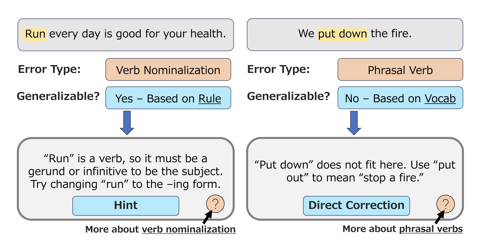

# Annotating Learner Errors for Automated Feedback

This repository contains the appendix and datasets detailed in the following research paper presented at [AIED 2025](https://aied2025.itd.cnr.it/):

> Annotating Errors in English Learners' Written Language Production: Advancing Automated Written Feedback Systems
>
> Steven Coyne, Diana Galvan-Sosa, Ryan Spring, Camélia Guerraoui, Michael Zock, Keisuke Sakaguchi and Kentaro Inui

You can [read the full paper here](https://doi.org/10.1007/978-3-031-98459-4_21).

## Introduction

When learners of English make grammatical errors, teachers may provide written corrective feedback. Our paper explores the use of LLMs to automatically generate feedback comments. To encourage high-quality feedback, we focus on detailed data annotation, specifically **error type**, **grammatical generalizability** and their relationship to the **directness** of feedback. Ideal systems would give hints and direct corrections in the same circumstances that human English teachers do:



Our work contributes a dataset of feedback comments on learner errors, a [new typology of error types](https://github.com/coynestevencharles/annotating-errors-wcf/blob/main/appendix/full_typology.pdf) that focuses on the learner's underlying knowledge gap, and a dataset of AI-generated feedback comments manually rated by experienced teachers of English as a second or foreign language.

## Contents

```md
appendix/
- Full typology of learner errors
- Guideline document for the error annotation and feedback writing task
- Guideline document used by teachers in the feedback rating task

feedback_dataset/
- Dataset of 456 learner sentences and feedback comments described in the paper, annotated by 2 annotators in 3 batches

rating_dataset/
- Dataset of 2312 manual expert ratings for the human-written feedback and AI-generated feedback. Each example was evalated by two of a group of 4 English teachers

templates/
- Collection of 149 manually-created feedback templates used in the experiment
- Ground-truth reference templates for the "train" (batches 1 and 2) and "test" (batch 3) settings

fb_setting_outputs/
- AI-generated feedback from 5 different systems, plus human feedback for reference. Separated into "train" (batches 1 & 2) and "test" (batch 3)

reference_tags/
- Map of ground-truth EXPECT and ERRANT tags for each example, used in the feedback generation experiments

prompts.py
- The prompts used by the feedback generation systems
```

## Datasets

### Feedback Dataset

Dataset of 456 learner sentences and feedback comments, drawn from [the EXPECT dataset](https://github.com/lorafei/Explainable_GEC) described in the paper [Enhancing Grammatical Error Correction Systems with Explanations (Fei et al., 2023)](https://doi.org/10.18653/v1/2023.acl-long.413). EXPECT is itself based on the [Write&Improve+LOCNESS corpus](https://www.cl.cam.ac.uk/research/nl/bea2019st/#data) released as part of [The BEA-2019 Shared Task on Grammatical Error Correction](https://doi.org/10.18653/v1/W19-4406), so each sentence ultimately originates there.

The data was processed by retokenizing a representative sample of EXPECT examples grouped by CEFR level and filtered to have one unique, contiguous error, and re-annotating them with [our error types](https://github.com/coynestevencharles/annotating-errors-wcf/blob/main/appendix/full_typology.pdf), highlights, and other annotations.

A detailed summary of the annotations can be found in [the Annotation Guidelines document](https://github.com/coynestevencharles/annotating-errors-wcf/blob/main/appendix/annotation_guidelines.pdf).

#### Feedback Data Example

```JSON
{
    "user_id": "a_1",
    "instance_id": 83,
    "original_id": "expect_train_2108",
    "cefr_level": "A",
    "instance_text": {
        "source": "My clients was very impolite.",
        "corrected": "My clients were very impolite."
    },
    "report": [],
    "error_properties": {
        "error_tag_1": "Grammar",
        "error_tag_2": "Subject-Verb Agreement",
        "error_tag_3": "default",
        "error_is_generalizable": true,
        "error_start": "11",
        "error_end": "14",
        "error_text": "was",
        "correction_start": "11",
        "correction_end": "15",
        "correction_text": "were"
    },
    "feedback": {
        "feedback_explanation": "The subject, \"clients,\" is plural. However, \"was\" can only be used with a singular subject.",
        "feedback_suggestion": "Change \"was\" to a form that goes with a plural subject.",
        "feedback_is_direct": false,
        "highlight_text": "clients was",
        "highlight_start": 3,
        "highlight_end": 14
    },
    "behavioral_data": {
        "time_string": "Time spent: 0d 0h 1m 23s "
    }
}
```

#### Notes on Feedback Data Fields

- `user_id`: ID of the annotator who wrote the feedback.
- `instance_id`: ID of the instance within its annotation batch.
- `original_id`: Which example from EXPECT this example comes from.
- `cefr_level`: The learner's CEFR level, either A, B, or C.
- `instance_text`: The sentence before and after correction.
- `report`: List containing reasons why the example was rejected by annotators. Empty for valid data.
- `error_tag_n`: Hierarchical categorization of the error using our typology. If the leaf tag is on the second level, `error_tag_3` will be `"default"`.
- `error_is_generalizable`: Grammatical generalizability of the error. See the paper or the [the Annotation Guidelines](https://github.com/coynestevencharles/annotating-errors-wcf/blob/main/appendix/annotation_guidelines.pdf) for details.
- `error_start` and `error_end`: Character indices of the error text.
- `correction_start` and `correction_end`: Character indices of the correction.
- `feedback_explanation`: Short description of **what is wrong** and **why**.
- `feedback_suggestion`: Short description of **what to do** to fix the error.
- `feedback_is_direct`: Directness of the feedback. `true` for direct corrections (revealing the exact string to use, or exact words to delete), `false` for hints.
- `highlight_start` and `highlight_end`: Character indices of the comment highlight, which must contain the entire error span, but may extend further. This is the span a learner would be shown.
- `time_string`: Sum of annotation time for this example.

#### Notes on Usage

- Similar to EXPECT, our data uses `"[NONE]"` in place of inserted or deleted words. Depending on the use case, users may want to remove these. Be sure to adjust spacing and highlight indices accordingly.
- It seems some instances of detokenized words, such as `ca n't`, were not retokenized properly. These were mentioned in the LLM and human comments, and are thus left in this data to reflect the conditions of the experiments. Users may want to recombine them.
- Some examples contain more than one sentence. If it is important to have exactly one sentence per example, these should be excluded or processed to remove the sentences that do not contain the target error.
- None of the data fields are a unique ID, but one can be constructed from the batch number, `instance_id`, and `annotator_id`.

### Feedback Rating Dataset

Dataset of 2312 manual expert ratings for the human-written feedback and AI-generated feedback. Each example was evalated by two out of a group of 4 English teachers that were hired as raters.

Note that while feedback was written and generated for both "train" and "test" sets, the human evaluations were only performed on the test set (i.e., batch 3).

Details on the rating task can be found in our [Rating Guidelines document](https://github.com/coynestevencharles/annotating-errors-wcf/blob/main/appendix/rating_guidelines.pdf).

#### Rating Data Example

```JSON
{
    "user_id": "r_4",
    "instance_id": 109,
    "rater_task_id": 1108,
    "instance_text": {
        "source": "My clients was very impolite.",
        "corrected": "My clients were very impolite.",
        "feedback": "The subject, \"clients,\" is plural, but \"was\" can only be used with a singular subject. Change \"was\" to a form that goes with a plural subject."
    },
    "report": [],
    "behavioral_data": {
        "time_string": "Time spent: 0d 0h 0m 18s "
    },
    "rater_comment": "",
    "is_relevant": true,
    "is_factual": true,
    "has_what_and_why": true,
    "has_what_to_do": true,
    "is_comprehensible": true,
    "has_out_of_scope": false,
    "is_direct": "Hint",
    "feedback_quality": 4,
    "annotation_instance_id": "batch_3_083",
    "annotator_id": "a_2",
    "rating_highlight_start": 3,
    "rating_highlight_end": 14,
    "rating_highlight_text": "clients was",
    "correction_start": 11,
    "correction_end": 15,
    "correction_text": "were",
    "fb_source": "template_system"
}
```

#### Notes on Rating Data Fields

- `user_id`: ID of the **rater** evaluating the example.
- `instance_id`: ID of the instance within its **rating task** batch.
- `rater_task_id`: Global, unique ID for the rating instance.
- `feedback`: The concatenated feedback (`feedback_explanation` and `feedback_suggestion`) from either the feedback dataset or an AI-based system.
- `rater_comment`: Optional freeform comment field for raters.
- `is_relevant`: Whether the feedback is relevant to the highlighted error.
- `is_factual`: Whether the feedback is factually correct.
- `has_what_and_why`: Whether the feedback explains what is wrong and why (~validity of `feedback_explanation`).
- `has_what_to_do`: Whether the feedback explains what is wrong and why (~validity of `feedback_suggestion`).
- `is_comprehensible`: Rater judgement of whether a CEFR B1-B2 academic learner of English is likely to understand this comment.
- `has_out_of_scope`: Whether the feedback has content inappropriate or out of place in the expected context. See the [Rating Guidelines](https://github.com/coynestevencharles/annotating-errors-wcf/blob/main/appendix/rating_guidelines.pdf) for details.
- `is_direct`: Rater's judgement of whether the feedback comment is a hint or direct correction. Can be `"N/A"` if `has_what_to_do` is `false`, so it is a string field, as we reserved `null` for rejected instances and bugs. Note that when `fb_source` is `"human"`, this can differ from the human feedback writer's original directness annotation.
- `feedback_quality`: 1-5 Likert rating of overall feedback quality.
- `rating_highlight` fields: Similar to the `highlight` fields in the feedback, but altered to remove `[NONE]` tokens, which affects some indices.
- `annotation_instance_id`: The concatenated batch number and annotation_id of this instance in the feedback dataset. Each text-correction pair has a unique `annotation_instance_id`, but is repeated once for each source of feedback.
- `annotator_id`: ID of the human annotator whose annotations this instance is based on. In the experiment, `a_1` and `a_2` are equally represented.
- `fb_source`: The source if the feedback on this rating task instance. Can be the name of an AI system, or `"human"` when taken directly from the feedback dataset.

## Citation

```bibtex
@inproceedings{coyne-2025-annotating,
title="Annotating Errors in English Learners' Written Language Production: Advancing Automated Written Feedback Systems",
author="Coyne, Steven
    and Galvan-Sosa, Diana
    and Spring, Ryan
    and Guerraoui, Cam{\'e}lia
    and Zock, Michael
    and Sakaguchi, Keisuke
    and Inui, Kentaro",
editor="Cristea, Alexandra I.
    and Walker, Erin
    and Lu, Yu
    and Santos, Olga C.
    and Isotani, Seiji",
booktitle="Artificial Intelligence in Education",
year="2025",
publisher="Springer Nature Switzerland",
address="Cham",
pages="292--306",
doi="10.1007/978-3-031-98459-4_21",
isbn="978-3-031-98459-4"
}
```
